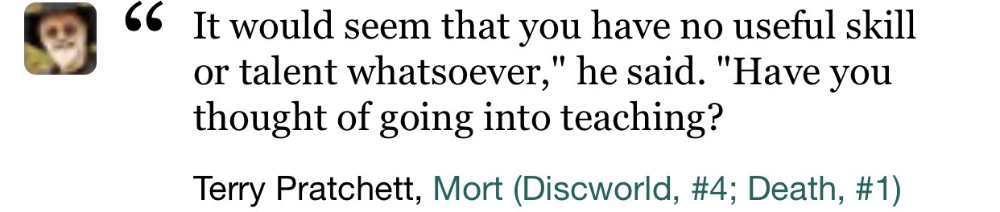
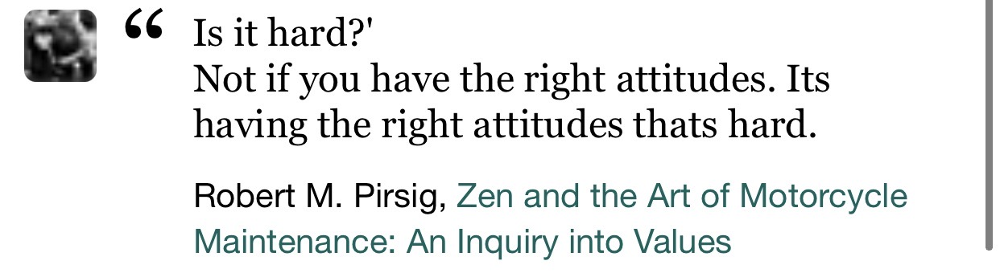

% Business Applications BAP
% Florian Hassanen & Joachim Grüneis
% 2021/2022

## Vision

 Software Engineering Methologies and Practises to achieve

 * Infrastructure as code
 * Documentation as code
 * Always ready to deliver
 * 100% Automated
 * 100% Reproduceable

## Team

* Florian Hassanen
    * seit 2008 als Software Entwickler tätig
    * seit 2014 Fachtheorielehrer an der Spengergasse in Nebenbeschäftigung
* Joachim Grüneis
    * seit 1992 als Software Entwickler tätig
    * seit 2013 Fachtheorielehrer an der Spengergasse in Nebenbeschäftigung

## Team

## Topics

* General Agile Practices
* Source Code Management
* Build Management / Project Structure Layout
* Deployment Architectures and Strategies (incl containers)
* Software Quality Management
* Test Processes and Methods

## Is it hard

## Facts

* Tightly coupled with POS
* Extremely useful and good practice in diploma projects
* Lots of hands-on doing
    * Infrastructure as code (development and runtime)
    * Documentation as code
    * Continuous integration/deployment/delivery (as code)
